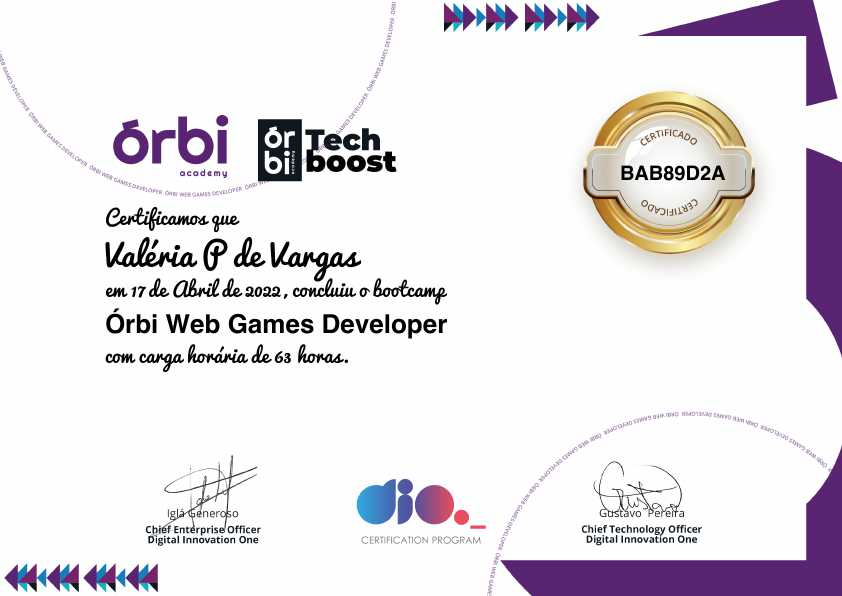

# Dio-Desafio-Github
Repositório no GitHub Para Compartilhar o Progresso e Projetos feitos nos Bootcamps

## Órbi Web Games Developer
- [Jogo da Velha](https://github.com/ValchanOficial/Dio-Jogo-Da-Velha)
- [Primeiro jogo de naves](https://github.com/ValchanOficial/Dio-Jogo-Naves)
- [Jogo de memória estilo Genius](https://github.com/ValchanOficial/Dio-Jogo-Genius)
- [Jogo no estilo Space Shooter](https://github.com/ValchanOficial/Dio-Space-Shooter)
- [Jogo do Dinossauro do Google](https://github.com/ValchanOficial/Dio-Dino-Game)

